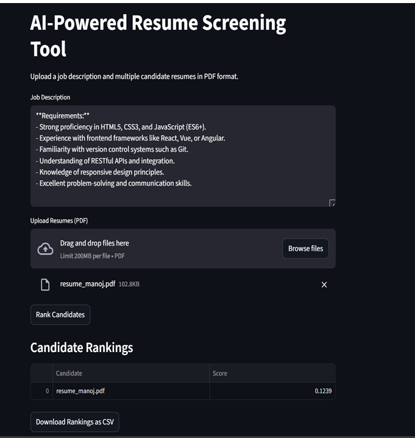
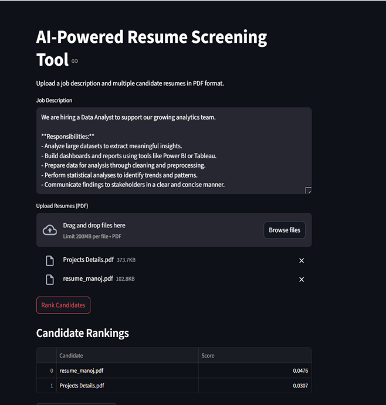

# RESUME-RANKING
🔍 AI-Powered Resume Screening Tool
An interactive Streamlit-based web app that helps recruiters automatically rank candidate resumes based on how well they match a given job description using Natural Language Processing (NLP) and machine learning.

🚀 Features
Upload a Job Description directly into the app.

Upload multiple PDF resumes.

Uses spaCy for text preprocessing (lemmatization, stopword removal, etc.).

Applies TF-IDF Vectorization and Cosine Similarity to rank resumes.

Intuitive and clean web interface with real-time output.

Embeddable using a custom HTML UI wrapper.

🧠 Tech Stack
Python 🐍

Streamlit 🌐

spaCy (NLP)

scikit-learn (TF-IDF & similarity)

PyPDF2 (PDF parsing)

💡 How It Works
Enter or paste a Job Description.

Upload one or more resumes in PDF format.

The tool processes text, computes similarity, and displays ranking sc

📸 UI Preview

